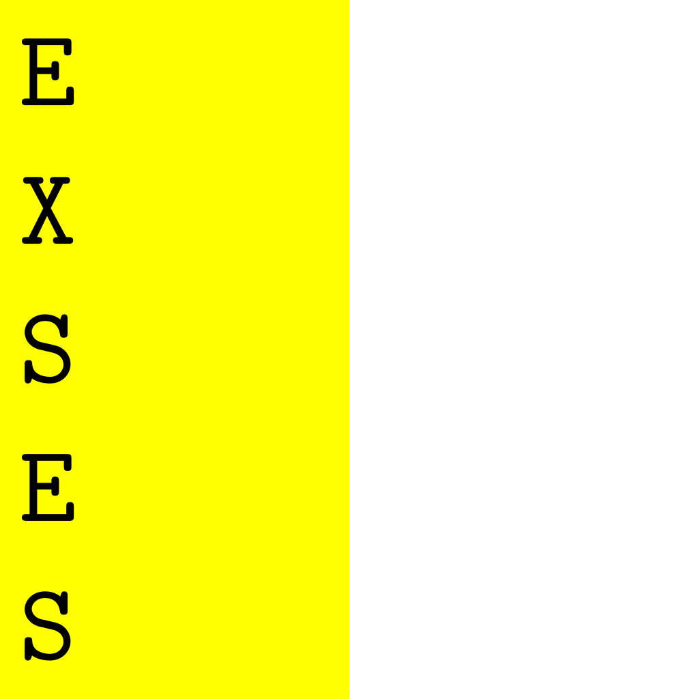

[](https://github.com/EndeyshentLabs/EXSES/actions/workflows/cmake.yml)

# EXSES

**WARNING: THIS PROGRAMMING LANGUAGE IS UNFINISHED! EVERYTHING MAY CHANGE IN THE FUTURE!** 


EXSES - smol stack-oriented concatenative programming language. Development have just started: do not expect something revolutionary new.

## Example

### Basic

```bash
20 10 + ! # Will output the '30'
# Raise 5 to the power of 2
5 & # `&` will duplicate top value e.g '5'
* # Multiply
! # Output
```

### More advanced

```bash
# bind 500 to '1100'
1100 500 <-
# bind 80 to '1101'
1101 80 <-

# load value of '1100' (e.g 500)
1100 ^
# load value of '1101' (e.g 80)
1101 ^
- # subtract
! # print (420)
```

## Build-it

Dependencies:

- CMake >= 3.14
- Any C++ compiler with C++20 (I use GCC 12.2)

```console
$ cmake -G Ninja -B build
$ cmake --build build
$ vim test.xes
... WRITING ...
$ ./build/exsi test.xes
```
